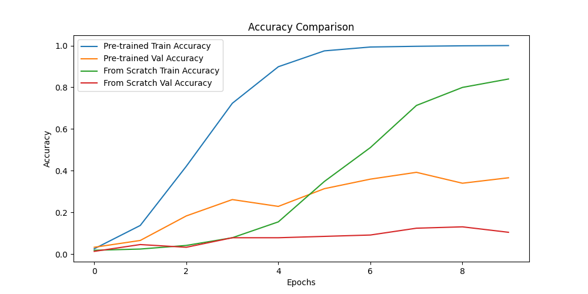

# Transfer Learning for Oxford Flowers Classification 🌼

This project demonstrates transfer learning using pre-trained models (e.g., VGG16) for image classification on the [Oxford Flowers dataset](https://www.robots.ox.ac.uk/~vgg/data/flowers/102/). It also compares the performance of a pre-trained model versus a model trained from scratch.

---

## Table of Contents
- [Project Overview](#project-overview)
- [Requirements](#requirements)
- [Installation](#installation)
- [Dataset](#dataset)
- [Models Used](#models-used)
- [Results](#results)
- [Usage](#usage)
- [License](#license)

---

## Project Overview

This project evaluates two approaches to image classification:
1. Using a pre-trained VGG16 model with transfer learning.
2. Training a custom convolutional neural network (CNN) from scratch.

The project highlights the advantages of transfer learning for small datasets and includes a detailed comparison of performance metrics such as accuracy and loss.

---

## Requirements

To run the project, make sure you have the following installed:

- Python 3.9+
- TensorFlow 2.9+
- Matplotlib
- TensorFlow Datasets (tfds)
- Numpy

You can install the required packages using `pip`:

```bash
pip install -r requirements.txt
```

---

## Installation

1. Clone this repository:


2. Set up a virtual environment (optional but recommended):

   ```bash
   python -m venv .venv
   source .venv/bin/activate   # On Windows, use .venv\Scripts\activate
   ```

3. Install dependencies:

   ```bash
   pip install -r requirements.txt
   ```

---

## Dataset

The dataset used is the **Oxford Flowers 102**, which contains 102 classes of flowers. It is automatically downloaded using TensorFlow Datasets:

```python
import tensorflow_datasets as tfds

dataset, info = tfds.load("oxford_flowers102", with_info=True, as_supervised=True)
```

---

## Models Used

### 1. Pre-trained Model: VGG16
- Utilizes the VGG16 architecture with pre-trained weights from ImageNet.
- Fine-tuned with an additional dense layer and an output layer for 102 classes.

### 2. Model Trained From Scratch
- A custom CNN architecture consisting of:
  - 3 convolutional layers
  - 3 max-pooling layers
  - Dropout for regularization
  - Fully connected layers for classification.

---

## Results

### Accuracy Comparison



### Loss Comparison


#### Key Metrics:
- **Pre-trained Model (VGG16):**
  - Test Accuracy: **39%**
  - Test Loss: **2.49**
- **Model From Scratch:**
  - Test Accuracy: **11%**
  - Test Loss: **5.20**

---

## Usage

1. Run the training and evaluation script:

   ```bash
   python main.py
   ```

2. Modify parameters (e.g., number of epochs, architecture) directly in `main.py`.

3. View the results in the terminal.

